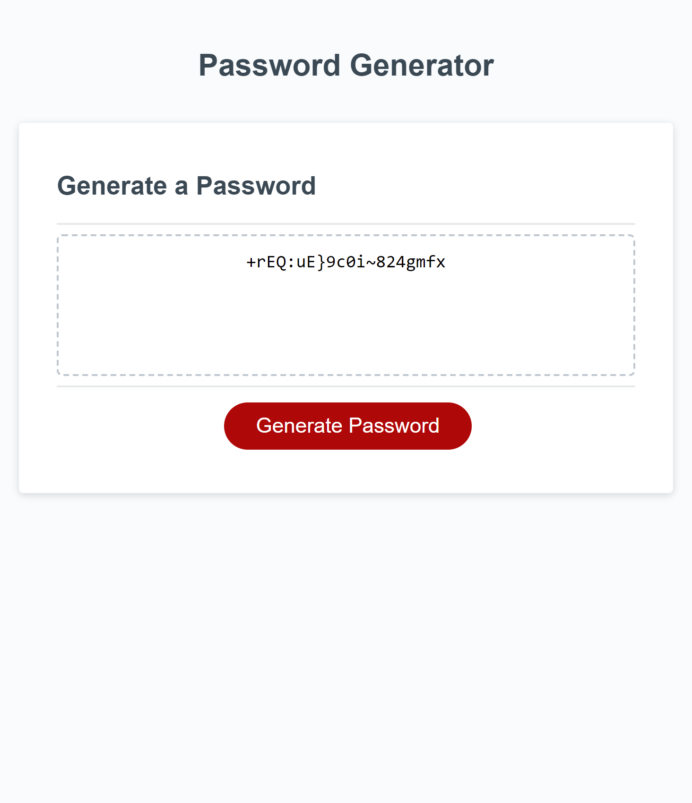

# Password-Generator

## Description
This is a password generator which functionability was implemented by using Javascript, an CSS style sheet was also implemented in the given starter code.
 
## Technical
- By clicking on the button "Generate Password" a prompt will ask the user to input the desired length of the password. 
- If the password is not at least 8 characters and no more than 128 characters long then an alert will pop and will return the user back to the first prompt.
- If the password length is between the accepted length then a series of confirm windows will ask the user to confirm which parameters wants to implement in the password. The user can choose between using lower case, upper case, numerical and special characters.
- If the user do not choose at least one parameter an alert will pop and will return him back to the first prompt.
- Once the user has selected at least one parameter the password will be generated and will be displayed in the "Your Secure Password" box.

## Usage

Click the link below to enter the site.
https://andyanza.github.io/Password-Generator/

## Credits
- During office hours when I asked for feedback about my challenge a classmate suggested me to use the join method to put together the character groups selected by the user into a single string. So I read this documentacion and implemented it to my own code. https://developer.mozilla.org/en-US/docs/Web/JavaScript/Reference/Global_Objects/Array/join#:~:text=The%20join()%20method%20creates,returned%20without%20using%20the%20separator 

- For the section of the code where the random password is generated, I also recived guidance during office hours where we were given a more in depth lesson about how math.random and math.floor works. But also I used this video as a guidance on how the syntax order was to be written for that part https://www.youtube.com/watch?v=BrwhggyEUTo&list=LL&index=2

